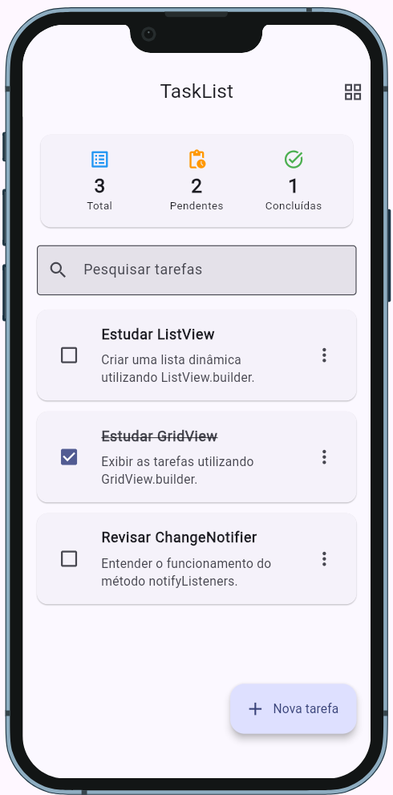
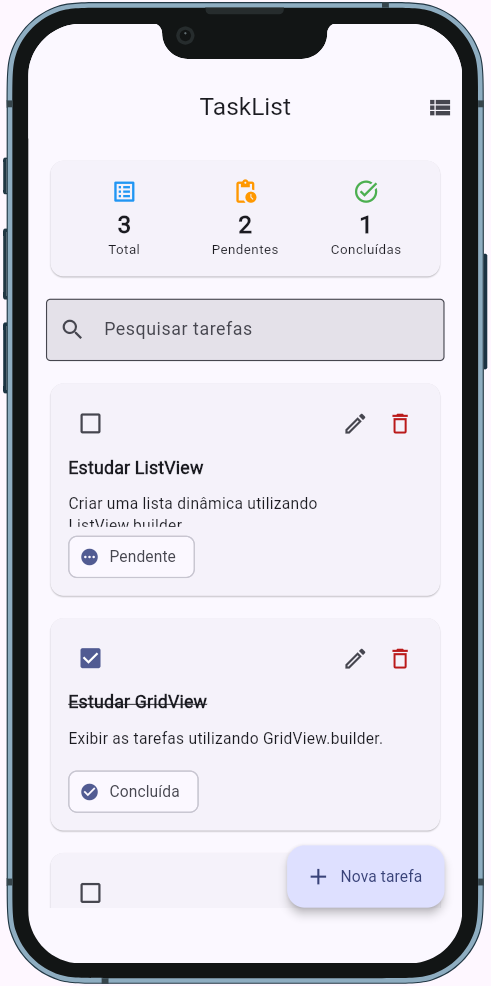
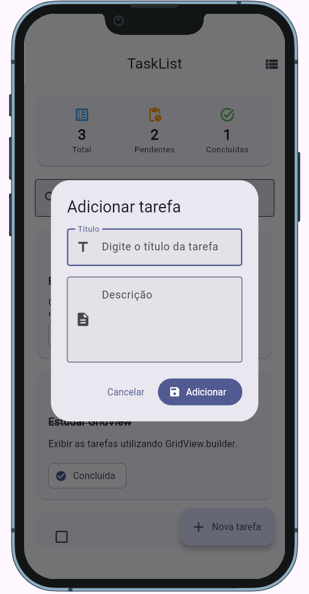
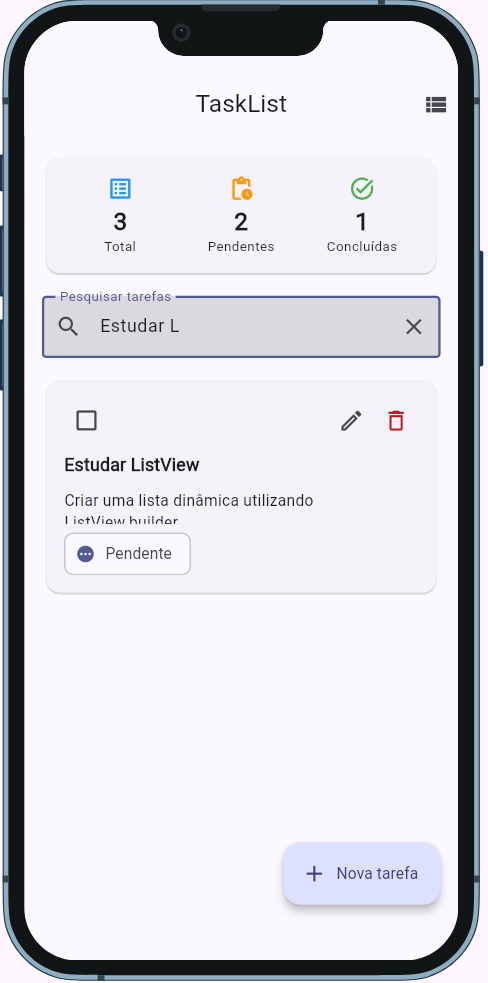

# TaskList Flutter

Aplicativo educacional desenvolvido em Flutter para demonstrar a construção de interfaces baseadas em coleções de dados utilizando `ListView` e `GridView`.

O projeto implementa um gerenciador de tarefas com operações de adicionar, consultar, atualizar, remover, pesquisar e concluir tarefas. A aplicação utiliza uma organização baseada em **Model, View e Controller**, gerenciamento de estado com `ChangeNotifier`, localização de dependências com `get_it` e visualização responsiva com `device_preview_plus`.

---

## Objetivo educacional

Este projeto foi desenvolvido como exemplo prático para a disciplina de **Programação Mobile**, com o objetivo de apresentar aos alunos conceitos fundamentais do desenvolvimento de aplicativos multiplataforma com Flutter.

Durante o desenvolvimento do projeto, são trabalhados os seguintes conteúdos:

- Estrutura básica de um projeto Flutter;
- Organização de código em pastas;
- Separação de responsabilidades;
- Arquitetura baseada em Model, View e Controller;
- Criação de listas dinâmicas;
- Utilização de `ListView.builder`;
- Utilização de `GridView.builder`;
- Desenvolvimento de interfaces responsivas;
- Gerenciamento de estado com `ChangeNotifier`;
- Atualização da interface com `AnimatedBuilder`;
- Localização de dependências com `get_it`;
- Criação e validação de formulários;
- Utilização de caixas de diálogo;
- Retorno de dados com `Navigator.pop`;
- Pesquisa e filtragem de elementos;
- Operações CRUD em memória;
- Componentização de interfaces;
- Material Design 3;
- Testes visuais com `device_preview_plus`.

---

## Sobre o aplicativo

O **TaskList** permite que o usuário organize tarefas pessoais, profissionais ou acadêmicas.

Cada tarefa possui os seguintes dados:

- Identificador;
- Título;
- Descrição;
- Status;
- Data de criação.

Uma tarefa pode possuir um dos seguintes estados:

- Pendente;
- Concluída.

As tarefas podem ser apresentadas de duas maneiras:

1. Em formato de lista, utilizando `ListView.builder`;
2. Em formato de grade, utilizando `GridView.builder`.

O usuário pode alternar entre os modos de visualização por meio de um botão localizado na barra superior da aplicação.

---

## Funcionalidades

### Adicionar tarefas

O usuário pode cadastrar uma nova tarefa informando:

- Título;
- Descrição.

Os campos são validados antes da inclusão.

### Listar tarefas

As tarefas podem ser visualizadas utilizando:

- `ListView.builder`;
- `GridView.builder`.

### Atualizar tarefas

O usuário pode alterar:

- Título;
- Descrição.

O mesmo formulário é reutilizado para cadastro e edição.

### Remover tarefas

Uma tarefa pode ser removida após a confirmação do usuário.

### Pesquisar tarefas

A pesquisa considera os seguintes campos:

- Título;
- Descrição.

A filtragem é realizada em tempo real conforme o usuário digita.

### Alterar o status

O usuário pode marcar uma tarefa como concluída ou retorná-la para o status pendente.

### Alternar a visualização

O usuário pode alternar entre:

- Visualização em lista;
- Visualização em grade.

### Exibir indicadores

A tela principal apresenta os seguintes indicadores:

- Quantidade total de tarefas;
- Quantidade de tarefas pendentes;
- Quantidade de tarefas concluídas.

### Interface responsiva

A quantidade de colunas do `GridView` é alterada de acordo com a largura disponível:

- Uma coluna em telas pequenas;
- Duas colunas em telas médias;
- Três colunas em telas maiores.

---

## Tecnologias utilizadas

O projeto utiliza as seguintes tecnologias e recursos:

- Flutter;
- Dart;
- Material Design 3;
- `ChangeNotifier`;
- `AnimatedBuilder`;
- `get_it`;
- `device_preview_plus`;
- `ListView.builder`;
- `GridView.builder`;
- `LayoutBuilder`;
- `Form`;
- `AlertDialog`.

---

## Dependências

As principais dependências do projeto são:

```yaml
dependencies:
  flutter:
    sdk: flutter

  get_it: ^9.2.1
  device_preview_plus: ^2.9.2
```

As versões podem variar conforme o SDK Flutter instalado.

Para adicionar as dependências, execute:

```bash
flutter pub add get_it
flutter pub add device_preview_plus
```

Depois, instale os pacotes:

```bash
flutter pub get
```

---

## Estrutura do projeto

A pasta `lib` está organizada da seguinte maneira:

```text
lib/
├── controller/
│   └── task_controller.dart
├── core/
│   └── dependency_injection.dart
├── model/
│   └── task.dart
├── view/
│   ├── task_form_dialog.dart
│   ├── task_grid_item.dart
│   ├── task_list_item.dart
│   └── task_list_view.dart
├── app.dart
└── main.dart
```

---

## Responsabilidades das pastas

### model

A pasta `model` contém as classes responsáveis pela representação dos dados da aplicação.

Neste projeto, a classe `Task` representa uma tarefa.

```dart
class Task {
  final int id;
  final String titulo;
  final String descricao;
  final bool concluida;
  final DateTime criadaEm;

  const Task({
    required this.id,
    required this.titulo,
    required this.descricao,
    required this.concluida,
    required this.criadaEm,
  });
}
```

### view

A pasta `view` contém as telas e os componentes visuais da aplicação.

A View é responsável por:

- Exibir os dados;
- Receber as interações do usuário;
- Chamar os métodos do controller;
- Apresentar as tarefas em lista;
- Apresentar as tarefas em grade;
- Exibir formulários;
- Exibir mensagens;
- Solicitar confirmação antes da exclusão.

### controller

A pasta `controller` contém a lógica da aplicação e o gerenciamento do estado.

O controller é responsável por:

- Adicionar tarefas;
- Atualizar tarefas;
- Remover tarefas;
- Pesquisar tarefas;
- Alterar o status das tarefas;
- Alternar a forma de visualização;
- Calcular os indicadores;
- Notificar a interface sobre alterações.

### core

A pasta `core` contém configurações compartilhadas pela aplicação.

Neste projeto, ela armazena a configuração do `get_it`.

---

## Arquitetura da aplicação

O projeto utiliza uma organização baseada em:

```text
Model
View
Controller
```

O fluxo básico da aplicação é:

```text
Usuário
   |
   v
View
   |
   | chama um método
   v
Controller
   |
   | altera os dados
   v
Model
   |
   | notifyListeners()
   v
View reconstruída
```

### Model

O Model representa os dados da aplicação.

A classe `Task` possui os seguintes atributos:

```dart
final int id;
final String titulo;
final String descricao;
final bool concluida;
final DateTime criadaEm;
```

A classe também possui o método `copyWith`, utilizado para criar uma nova tarefa a partir de uma tarefa existente.

```dart
Task copyWith({
  int? id,
  String? titulo,
  String? descricao,
  bool? concluida,
  DateTime? criadaEm,
}) {
  return Task(
    id: id ?? this.id,
    titulo: titulo ?? this.titulo,
    descricao: descricao ?? this.descricao,
    concluida: concluida ?? this.concluida,
    criadaEm: criadaEm ?? this.criadaEm,
  );
}
```

Exemplo de utilização:

```dart
final tarefaAtualizada = tarefa.copyWith(
  titulo: 'Estudar GridView',
  concluida: true,
);
```

O uso de `copyWith` permite trabalhar com objetos imutáveis, evitando a alteração direta dos atributos.

### View

A View representa a interface do aplicativo.

A tela principal utiliza um `AnimatedBuilder` para observar o controller:

```dart
AnimatedBuilder(
  animation: controller,
  builder: (context, child) {
    return Scaffold(
      body: Container(),
    );
  },
);
```

Sempre que o controller executa `notifyListeners()`, o método `builder` é chamado novamente.

### Controller

O controller estende a classe `ChangeNotifier`:

```dart
class TaskController extends ChangeNotifier {
  // Dados e operações da aplicação
}
```

Após modificar o estado, o controller executa:

```dart
notifyListeners();
```

Esse comando informa aos componentes interessados que houve uma alteração no estado.

---

## Gerenciamento de estado com ChangeNotifier

O `ChangeNotifier` é utilizado para armazenar e controlar o estado da aplicação.

O `TaskController` mantém os seguintes dados:

```dart
final List<Task> _tasks = [];

String _termoPesquisa = '';

TipoVisualizacao _tipoVisualizacao =
    TipoVisualizacao.lista;
```

Os dados internos são privados. A View acessa as informações por meio de getters:

```dart
List<Task> get tasks => List.unmodifiable(_tasks);

String get termoPesquisa => _termoPesquisa;

TipoVisualizacao get tipoVisualizacao =>
    _tipoVisualizacao;
```

O uso de `List.unmodifiable` impede que a View altere diretamente a lista armazenada no controller.

### Exemplo de atualização do estado

```dart
void adicionarTask({
  required String titulo,
  required String descricao,
}) {
  final task = Task(
    id: _proximoId++,
    titulo: titulo.trim(),
    descricao: descricao.trim(),
    concluida: false,
    criadaEm: DateTime.now(),
  );

  _tasks.add(task);

  notifyListeners();
}
```

O fluxo dessa operação é:

1. A View recebe os dados do formulário;
2. A View chama o método `adicionarTask`;
3. O controller cria uma tarefa;
4. A tarefa é adicionada à lista;
5. O controller executa `notifyListeners`;
6. O `AnimatedBuilder` reconstrói a interface;
7. A nova tarefa aparece na tela.

---

## Localização de dependências com get_it

O pacote `get_it` é utilizado como Service Locator.

A instância global é declarada da seguinte maneira:

```dart
final getIt = GetIt.instance;
```

O controller é registrado como singleton:

```dart
void configurarDependencias() {
  if (!getIt.isRegistered<TaskController>()) {
    getIt.registerSingleton<TaskController>(
      TaskController(),
    );
  }
}
```

O registro é realizado antes da execução da aplicação:

```dart
void main() {
  WidgetsFlutterBinding.ensureInitialized();

  configurarDependencias();

  runApp(
    DevicePreview(
      enabled: kDebugMode,
      builder: (context) => const TaskListApp(),
    ),
  );
}
```

A View recupera o controller desta maneira:

```dart
final TaskController controller =
    getIt<TaskController>();
```

Como o controller foi registrado como singleton, todas as partes da aplicação recebem a mesma instância.

### Vantagens do get_it

- Centraliza a criação das dependências;
- Evita a criação de múltiplas instâncias;
- Não depende do `BuildContext`;
- Reduz o acoplamento entre componentes;
- Facilita a substituição de implementações;
- Facilita a criação de testes.

---

## Uso do ListView

A visualização em lista utiliza `ListView.builder`.

```dart
ListView.builder(
  itemCount: tasks.length,
  itemBuilder: (context, index) {
    final task = tasks[index];

    return TaskListItem(
      key: ValueKey(task.id),
      task: task,
      onAlterarStatus: () {
        controller.alterarStatus(task.id);
      },
      onEditar: () {
        _abrirFormulario(task: task);
      },
      onRemover: () {
        _confirmarRemocao(task);
      },
    );
  },
);
```

O `ListView.builder` cria os elementos da lista conforme eles são necessários para exibição.

Cada elemento é representado pelo componente:

```text
TaskListItem
```

Esse componente apresenta:

- Checkbox;
- Título;
- Descrição;
- Opção para editar;
- Opção para remover.

A criação de um componente separado melhora:

- Organização;
- Reutilização;
- Legibilidade;
- Manutenção;
- Testabilidade.

---

## Uso do GridView

A visualização em grade utiliza `GridView.builder`.

```dart
GridView.builder(
  itemCount: tasks.length,
  gridDelegate:
      SliverGridDelegateWithFixedCrossAxisCount(
    crossAxisCount: colunas,
    crossAxisSpacing: 12,
    mainAxisSpacing: 12,
    childAspectRatio: colunas == 1 ? 1.8 : 1.15,
  ),
  itemBuilder: (context, index) {
    final task = tasks[index];

    return TaskGridItem(
      key: ValueKey(task.id),
      task: task,
      onAlterarStatus: () {
        controller.alterarStatus(task.id);
      },
      onEditar: () {
        _abrirFormulario(task: task);
      },
      onRemover: () {
        _confirmarRemocao(task);
      },
    );
  },
);
```

Cada tarefa é representada por um cartão criado pelo componente:

```text
TaskGridItem
```

O `SliverGridDelegateWithFixedCrossAxisCount` define:

- Quantidade de colunas;
- Espaçamento horizontal;
- Espaçamento vertical;
- Proporção dos cartões.

---

## Responsividade do GridView

A aplicação utiliza `LayoutBuilder` para verificar a largura disponível.

```dart
LayoutBuilder(
  builder: (context, constraints) {
    int colunas = 1;

    if (constraints.maxWidth >= 900) {
      colunas = 3;
    } else if (constraints.maxWidth >= 600) {
      colunas = 2;
    }

    return GridView.builder(
      gridDelegate:
          SliverGridDelegateWithFixedCrossAxisCount(
        crossAxisCount: colunas,
        crossAxisSpacing: 12,
        mainAxisSpacing: 12,
        childAspectRatio:
            colunas == 1 ? 1.8 : 1.15,
      ),
      itemCount: tasks.length,
      itemBuilder: (context, index) {
        final task = tasks[index];

        return TaskGridItem(
          task: task,
          onAlterarStatus: () {
            controller.alterarStatus(task.id);
          },
          onEditar: () {
            _abrirFormulario(task: task);
          },
          onRemover: () {
            _confirmarRemocao(task);
          },
        );
      },
    );
  },
);
```

A quantidade de colunas segue a largura disponível:

```text
Largura menor que 600 pixels    -> 1 coluna
Largura entre 600 e 899 pixels  -> 2 colunas
Largura a partir de 900 pixels  -> 3 colunas
```

Essa abordagem permite adaptar a interface para:

- Smartphones;
- Tablets;
- Navegadores;
- Aplicações desktop.

---

## Pesquisa de tarefas

A pesquisa é realizada de forma reativa.

Na View:

```dart
TextField(
  controller: pesquisaController,
  onChanged: controller.pesquisar,
  decoration: const InputDecoration(
    labelText: 'Pesquisar tarefas',
    hintText: 'Digite o título ou a descrição',
    prefixIcon: Icon(Icons.search),
    border: OutlineInputBorder(),
  ),
);
```

No controller:

```dart
void pesquisar(String termo) {
  _termoPesquisa = termo;
  notifyListeners();
}
```

As tarefas filtradas são obtidas pelo getter:

```dart
List<Task> get tasksFiltradas {
  if (_termoPesquisa.trim().isEmpty) {
    return List.unmodifiable(_tasks);
  }

  final termo = _termoPesquisa.toLowerCase().trim();

  return _tasks.where((task) {
    return task.titulo.toLowerCase().contains(termo) ||
        task.descricao.toLowerCase().contains(termo);
  }).toList();
}
```

A pesquisa não diferencia letras maiúsculas e minúsculas.

Os termos abaixo produzem resultados equivalentes:

```text
flutter
Flutter
FLUTTER
```

---

## Formulário de tarefas

O formulário utiliza o widget `Form`.

A validação é controlada por uma `GlobalKey<FormState>`:

```dart
final _formKey = GlobalKey<FormState>();
```

Antes de salvar os dados, a validação é executada:

```dart
if (!_formKey.currentState!.validate()) {
  return;
}
```

O título é obrigatório e deve possuir pelo menos três caracteres:

```dart
validator: (value) {
  if (value == null || value.trim().isEmpty) {
    return 'Informe o título da tarefa.';
  }

  if (value.trim().length < 3) {
    return 'O título deve possuir pelo menos 3 caracteres.';
  }

  return null;
},
```

A descrição também é obrigatória:

```dart
validator: (value) {
  if (value == null || value.trim().isEmpty) {
    return 'Informe a descrição da tarefa.';
  }

  return null;
},
```

---

## Retorno de dados com Navigator

O formulário é apresentado por meio de `showDialog`.

```dart
final resultado = await showDialog<TaskFormResult>(
  context: context,
  builder: (context) {
    return TaskFormDialog(task: task);
  },
);
```

Quando o usuário confirma o formulário, os dados são devolvidos com `Navigator.pop`:

```dart
Navigator.of(context).pop(
  TaskFormResult(
    titulo: _tituloController.text.trim(),
    descricao: _descricaoController.text.trim(),
  ),
);
```

Quando o usuário cancela:

```dart
Navigator.of(context).pop();
```

Se o resultado for `null`, nenhuma operação será realizada:

```dart
if (resultado == null) {
  return;
}
```

---

## Confirmação de exclusão

Antes de remover uma tarefa, o aplicativo apresenta uma caixa de confirmação.

```dart
final confirmar = await showDialog<bool>(
  context: context,
  builder: (context) {
    return AlertDialog(
      title: const Text('Remover tarefa'),
      content: Text(
        'Deseja realmente remover a tarefa '
        '"${task.titulo}"?',
      ),
      actions: [
        TextButton(
          onPressed: () {
            Navigator.of(context).pop(false);
          },
          child: const Text('Cancelar'),
        ),
        FilledButton(
          onPressed: () {
            Navigator.of(context).pop(true);
          },
          child: const Text('Remover'),
        ),
      ],
    );
  },
);
```

A remoção ocorre somente quando o resultado for verdadeiro:

```dart
if (confirmar == true) {
  controller.removerTask(task.id);
}
```

---

## Operações CRUD

CRUD é um acrônimo utilizado para representar quatro operações básicas:

```text
Create -> Criar
Read   -> Consultar
Update -> Atualizar
Delete -> Remover
```

### Create

A operação de criação adiciona uma tarefa.

```dart
controller.adicionarTask(
  titulo: resultado.titulo,
  descricao: resultado.descricao,
);
```

### Read

A operação de consulta obtém as tarefas.

```dart
final tasks = controller.tasksFiltradas;
```

### Update

A operação de atualização modifica os dados de uma tarefa.

```dart
controller.atualizarTask(
  id: task.id,
  titulo: resultado.titulo,
  descricao: resultado.descricao,
);
```

### Delete

A operação de remoção exclui uma tarefa.

```dart
controller.removerTask(task.id);
```

Neste projeto, todas as operações são realizadas em memória.

---

## Indicadores

O controller calcula a quantidade total de tarefas:

```dart
int get quantidadeTotal => _tasks.length;
```

A quantidade de tarefas concluídas:

```dart
int get quantidadeConcluidas =>
    _tasks.where((task) => task.concluida).length;
```

A quantidade de tarefas pendentes:

```dart
int get quantidadePendentes =>
    _tasks.where((task) => !task.concluida).length;
```

Esses valores são atualizados automaticamente sempre que uma tarefa é:

- Adicionada;
- Removida;
- Marcada como concluída;
- Retornada para pendente.

---

## Device Preview Plus

O pacote `device_preview_plus` permite visualizar a aplicação em diferentes tamanhos de tela durante o desenvolvimento.

No arquivo `main.dart`:

```dart
runApp(
  DevicePreview(
    enabled: kDebugMode,
    builder: (context) => const TaskListApp(),
  ),
);
```

No `MaterialApp`:

```dart
MaterialApp(
  useInheritedMediaQuery: true,
  locale: DevicePreview.locale(context),
  builder: DevicePreview.appBuilder,
);
```

A propriedade abaixo habilita o Device Preview apenas durante o desenvolvimento:

```dart
enabled: kDebugMode
```

Com o `device_preview_plus`, é possível testar visualmente:

- Diferentes dimensões de tela;
- Orientação retrato;
- Orientação paisagem;
- Escala dos textos;
- Tema claro;
- Tema escuro;
- Diferentes idiomas;
- Áreas seguras da tela.

O Device Preview auxilia na avaliação inicial da responsividade, mas não substitui testes em dispositivos físicos ou emuladores.

---

## Material Design 3

O Material Design 3 é habilitado na configuração do tema:

```dart
theme: ThemeData(
  useMaterial3: true,
  colorSchemeSeed: Colors.indigo,
  brightness: Brightness.light,
),
```

O aplicativo também possui suporte ao tema escuro:

```dart
darkTheme: ThemeData(
  useMaterial3: true,
  colorSchemeSeed: Colors.indigo,
  brightness: Brightness.dark,
),
```

O tema utilizado acompanha a configuração do sistema operacional:

```dart
themeMode: ThemeMode.system,
```

---

## Como executar o projeto

### Pré-requisitos

Antes de executar o projeto, é necessário possuir:

- Flutter SDK instalado;
- Dart SDK;
- Visual Studio Code, Android Studio ou IntelliJ IDEA;
- Emulador, navegador ou dispositivo físico configurado.

Para verificar a instalação do Flutter:

```bash
flutter doctor
```

### Clonar o repositório

```bash
git clone URL_DO_REPOSITORIO
```

Acesse a pasta do projeto:

```bash
cd task_list
```

### Instalar as dependências

```bash
flutter pub get
```

### Executar a aplicação

```bash
flutter run
```

### Executar no Chrome

```bash
flutter run -d chrome
```

### Listar os dispositivos disponíveis

```bash
flutter devices
```

### Executar em um dispositivo específico

```bash
flutter run -d ID_DO_DISPOSITIVO
```

---

## Executando no Flutter Web

Verifique se o suporte ao Flutter Web está habilitado:

```bash
flutter config --enable-web
```

Liste os dispositivos disponíveis:

```bash
flutter devices
```

Execute no navegador Chrome:

```bash
flutter run -d chrome
```

Para gerar a versão Web:

```bash
flutter build web
```

Os arquivos gerados serão armazenados em:

```text
build/web/
```

---

## Gerando o aplicativo Android

Para gerar um APK:

```bash
flutter build apk
```

O arquivo será gerado em:

```text
build/app/outputs/flutter-apk/app-release.apk
```

Para gerar um Android App Bundle:

```bash
flutter build appbundle
```

O arquivo será gerado em:

```text
build/app/outputs/bundle/release/app-release.aab
```

---

## Análise e formatação do código

Para verificar possíveis problemas no código:

```bash
flutter analyze
```

Para formatar os arquivos Dart:

```bash
dart format lib
```

Para executar testes:

```bash
flutter test
```

---

## Visualizando o README no Visual Studio Code

Abra o arquivo `README.md` no Visual Studio Code.

Para abrir somente a visualização formatada, utilize:

```text
Ctrl + Shift + V
```

Para abrir a visualização ao lado do código:

1. Pressione `Ctrl + K`;
2. Solte as teclas;
3. Pressione `V`.

Também é possível abrir a Paleta de Comandos:

```text
Ctrl + Shift + P
```

Em seguida, pesquise por:

```text
Markdown: Open Preview to the Side
```

---


### Visualização em lista



### Visualização em grade



### Cadastro de tarefa




### Pesquisa de tarefas



---


## Contribuição

Contribuições acadêmicas são bem-vindas.

Para contribuir:

1. Crie um fork do projeto;
2. Crie uma nova branch;
3. Implemente a alteração;
4. Execute a análise do código;
5. Faça o commit;
6. Envie a branch;
7. Abra um Pull Request.

Exemplo:

```bash
git checkout -b feature/filtro-por-status
git add .
git commit -m "Adiciona filtro de tarefas por status"
git push origin feature/filtro-por-status
```


---

## Licença

Este projeto possui finalidade educacional.

O código pode ser utilizado, modificado e distribuído em atividades acadêmicas, estudos e demonstrações.

---


## Autor

Desenvolvido como material didático para a disciplina de **Programação Mobile**.

**Professor:** Rodrigo Plotze

---